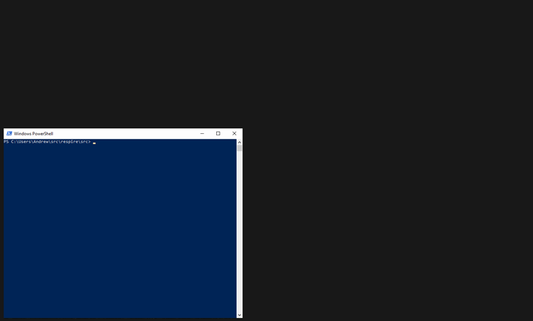
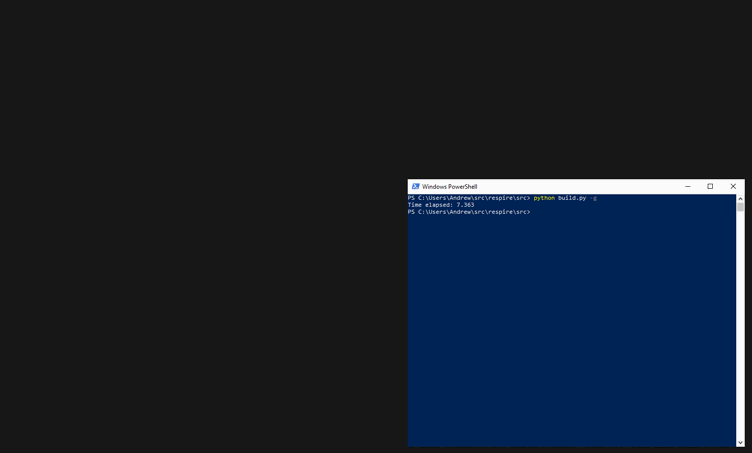

# Respire 

[](https://github.com/aabtop/respire/actions)

## Introduction

Respire provides logic to describe and execute an arbitrary file dependency
graph.  It is a build system tool, like
[make](https://www.gnu.org/software/make/), however unlike make it offers the
full power of [Python](https://www.python.org/) to setup build rules enabling a
more high level description of a dependency graph.  Respire is compatible with
both Python 2 and 3.

[SCons](https://scons.org/) is a similar build system tool that offers the
expressiveness of Python to describe a build dependency graph, however SCons
is known to be slow to execute.  On the other hand, Respire caches the results
of executed Python scripts into easy to parse low-level file dependencies so
that unless the Python logic is modified, the Python interpreter will not need
to be invoked.  This low-level cached file format (currently stored as JSON)
serves a similar role as the input to the [ninja](https://ninja-build.org/)
build system, in that it's meant to be parsed quickly, and not to be analyzed by
humans.

A core set of functionality is provided enabling direct specification of a
per-file dependency graph.  It can be tedious to define large projects in this
way, so higher-level utilities are available on top of the core functionality.
This enables, for example, C++ projects to be defined in terms of modules, like
executables, static libraries and dynamic libraries.  No magic is involved in
the creation of these libraries, and so anyone is free to build their own in
order to create a domain specific language for specifying build targets for
custom tools or other programming languages.

### Demos

#### Executing Respire on a project for the first time

Here is an animation showing what happens when Respire is used to build the
Respire core project itself.  Note the `-g` command line parameter which enables
a visualization of the build process which will open and render in a browser
as a web page.



Note that in the above animation there are two phases:

 1. The beginning where the Python scripts which define the build dependency
    graph are executed.
 1. The second phase where the actual build instructions are executed.

In the first phase, the dependency graph can be seen in the process of updating,
as more Python is executed and the results are collected by the Respire core
engine.

In the next animation, starting from where we ended in the first animation we
see Respire being invoked to run the unit and end-to-end tests packaged with
Respire itself.

Note also that multiple tasks are executed in parallel, one per thread available
on the system.

The grey nodes are nodes that are defined in the build files and available for
building, but were not requested to be built at that time.  In this example,
they are packaging and testing steps. The next animation goes on to run those
build steps.

#### Re-running respire to build tests and packaging



Note that:

 * We do not rebuild items that had already been built and whose dependencies
   have not changed.
 * We do not have to wait for any Python to execute this time (e.g. "phase 1"
   from above), because the results from the Python execution have been cached
   from the first run.

In this second example, we are packaging the Respire project and running the
tests, both tasks which require the Respire core project to be built already,
as was done in the first animation.

The two circles of nodes on the right represent the packages, where most of
the nodes represent Python file copies, where we copy the Python source code
representing the Respire environment into a directory that also contains the
Respire core executable.  Two copies are made, one for packaging and shipping,
and one for testing.

The testing one is used to enable end-to-end tests where test Python build steps
are run, which ultimately invoke Respire core, and the resulting file system
state is tested for correctness.

## Building Respire

While Respire can be built by Respire, it can also be built using
[CMake](https://cmake.org/), in order to bootstrap the process.

### Build with CMake

There is a [CMakeLists.txt](src/CMakeLists.txt) file in the [src/](src)
directory.  Respire is confirmed to be buildable on Windows using
[MSVC](https://visualstudio.microsoft.com/vs/features/cplusplus/) and on
Linux with [g++](https://gcc.gnu.org/).

Once built, you will need to install the result, e.g. by running

```
cmake --build . --target install
```

and then add the `${CMAKE_OUT}/package/python` directory to your `PYTHONPATH`
environment variable.

Typically, Respire projects provide a build entry point Python script which
must be executed in order to kick off the build.  See
[src/example/SimpleMultiSourceCPP/build.py](src/example/SimpleMultiSourceCPP/build.py)
for an example entry point script.

### Build with Respire

Once Respire is installed on a system (e.g. see
[Build with CMake](#Build-With-CMake)), then Respire can be built using itself
by running:

```
python src/build.py
```

By default, the output will appear in a newly created `out/` folder. By default
a debug build is generated and the Respire binary executable is not packaged
with the associated Python files.  In order to produce the final packaged
output, call:

```
python src/build.py -t package
```

which will output the results into the directory `out/debug/package` (e.g. you
could set your `PYTHONPATH` to this directory in order to use this new instance
of Respire for future Respire builds).

In order to build a release build of respire, and package the results, call

```
python src/build.py -t package -c release
```

and the results will be available in `out/release/package`.

## Example

### Small C++ Project

The directory
[src/example/SimpleMultiSourceCPP](src/example/SimpleMultiSourceCPP) contains
a small example of how to use Respire's high level C++ layer to define a
small C++ project.  For convenience, the build file for this example project
is inlined here:

```python
import respire.buildlib.cc as cc 
import respire.buildlib.cc_toolchains.discovery as cc_discovery
import respire.buildlib.modules as modules

def EntryPoint(registry, out_dir):
  toolchain = cc_discovery.DiscoverHostToolchain()
  configured_toolchain = cc.ToolchainWithConfiguration(
      toolchain, cc.Configuration())

  main_module = modules.ExecutableModule(
      'simple_multi_source_cpp', registry, out_dir, configured_toolchain,
      sources=[
        'main.cc',
        'database.cc',
        'database.h',
      ])

  for output in main_module.GetOutputFiles():
    registry.Build(output)
```
